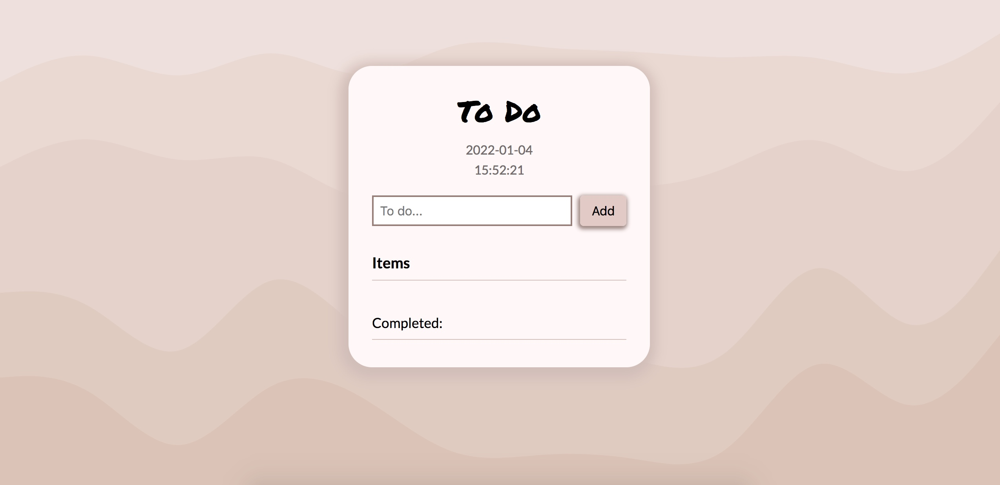

# To-Do App
A simple to-do list built with JavaScript where users can add and check off tasks. This was a school project where I got to practice the basics of DOM manipulation and event handling, using classes, working with arrays and utilizing local storage to store and retrieve data.

### Links
- Live Site URL: https://malinstodo.netlify.app/

### Built with
- HTML
- CSS 
- SASS
- Flexbox
- JavaScript
- Mobile-first workflow

## Author
- GitHub - [malin-nilsson](https://github.com/malin-nilsson)
