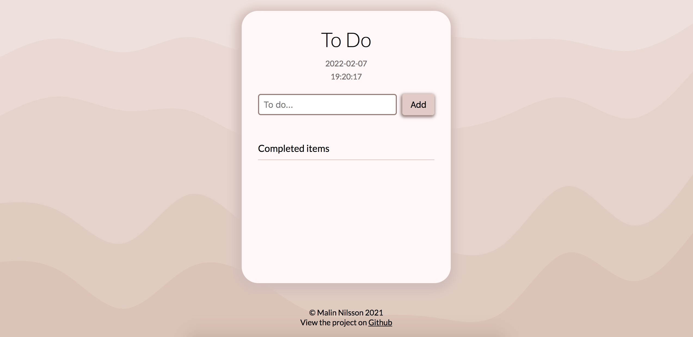

# To-Do App
A simple to-do list built with JavaScript where users can add and check off tasks. 

This was a school project where I got to practice the basics of DOM manipulation and event handling, using classes, working with arrays and utilizing local storage to store and retrieve data. The goal of this project was also to learn and improve my skills in unit testing with Cypress.

### Links
- Live Site URL: https://malinstodo.netlify.app/

### Built with
- HTML & SASS
- Mobile-first workflow
- JavaScript
- Cypress

## Author
- GitHub - [malin-nilsson](https://github.com/malin-nilsson)
